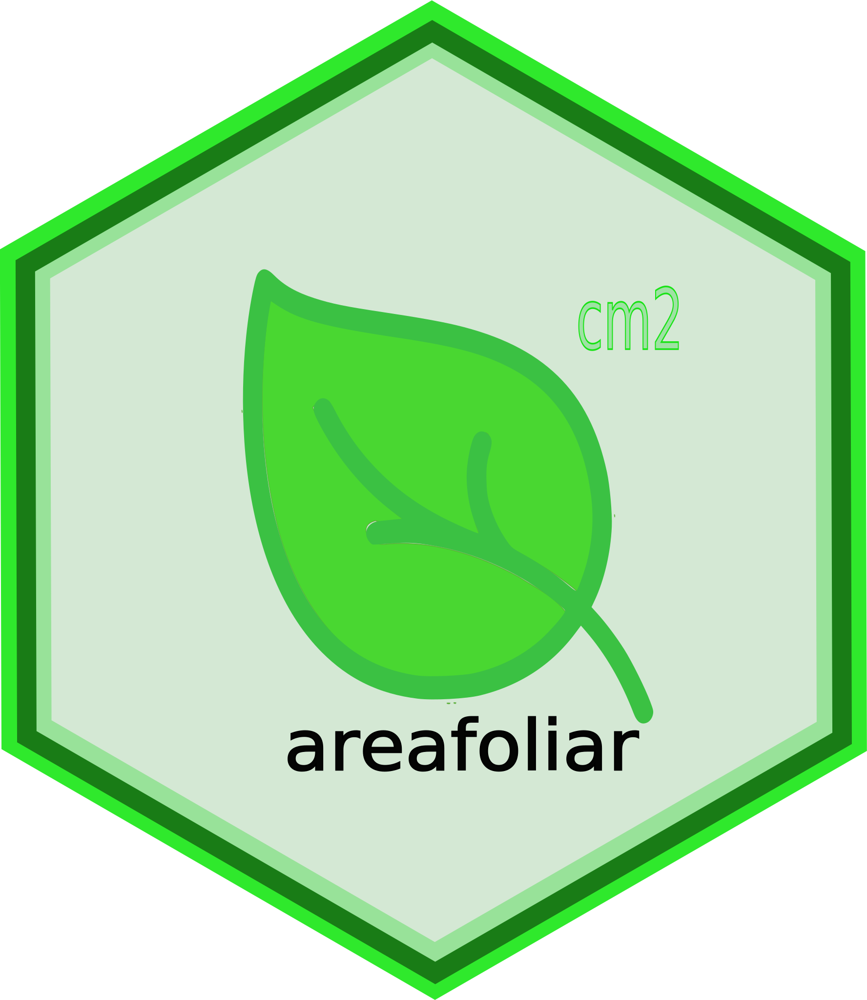
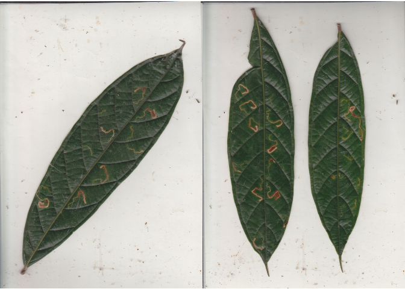

<!-- README.md is generated from README.Rmd. Please edit that file -->

# areafoliar 

<!-- badges: start -->

[](https://lifecycle.r-lib.org/articles/stages.html#experimental)
[](https://CRAN.R-project.org/package=areafoliar)
<!-- badges: end -->

An interface for the image processing program ‘ImageJ’, allowing leaf
area measurements and result processing.

## Installation

You can install the development version of `areafoliar` like so:

``` r
pak::pak("PaulESantos/areafoliar")
```

## Example

This is a basic example which shows you how to use `areafoliar`:

``` r
library(areafoliar)
```

``` r
img <- areafoliar::read_img_scans(fs::path_package(package = "areafoliar",
                                            "images"))
```

- Images

``` r
cowplot::plot_grid(
cowplot::ggdraw() +
  cowplot::draw_image( image = img[1]),
cowplot::ggdraw() +
  cowplot::draw_image( image = img[2])
)
```



- Get leaf area

``` r
leaf_area <- img |> 
areafoliar::map_leaf_area(output.folder = "output") 

[1] "C:\\Users\\user\\AppData\\Local\\R\\win-library\\4.2\\areafoliar\\images\\A300-1.jpeg"
[2] "C:\\Users\\user\\AppData\\Local\\R\\win-library\\4.2\\areafoliar\\images\\A300-2.jpeg"

E:\leaf_area_julia>pushd C:\Program Files\ImageJ\ 

C:\Program Files\ImageJ>jre\bin\java -jar -Xmx4g ij.jar -batch C:\Users\user\AppData\Local\Temp\Rtmp4ctn2k\macro3af8666d50b5.txt E:\leaf_area_julia\temp_folder/ 
    Area    XStart  YStart
1   15.125  570 176
    Area    XStart  YStart
1   13.815  152 0
2   10.031  499 38

C:\Program Files\ImageJ>pause
Press any key to continue . . . 

C:\Program Files\ImageJ>exit

leaf_area
                     id leaf_area_cm2
1  A300-1.jpeg.txt.Area        15.125
2 A300-2.jpeg.txt.Area1        13.815
3 A300-2.jpeg.txt.Area2        10.031
```

- Summarise leaf area data

``` r
leaf_area |> 
areafoliar::summarise_leaf_area()

      id numb_part leaf_area_cm2
1 A300-1         1        15.125
2 A300-2         2        23.846
```
